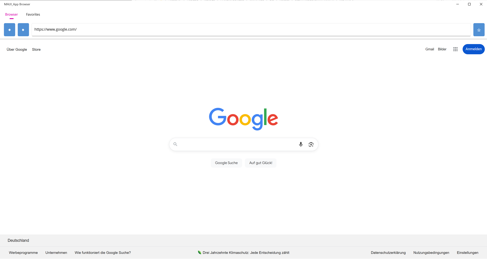

# 🖥️ Simpler Browser mit .NET MAUI

Ein minimaler Webbrowser, gebaut mit [`.NET MAUI`](https://learn.microsoft.com/dotnet/maui/).  
Das Projekt zeigt, wie man mit wenig Code einen funktionalen Browser mit Adresszeile und Navigation erstellt.

##  Features
- Eingabe einer URL und Laden der Webseite
- Vor- und Zurück-Navigation
- Favoriten
- Plattformübergreifend (Windows, macOS, Android, iOS)

##  Showcase

Hier eine kurze Demo des Browsers:

<video src="showcase.mp4" controls width="600"></video>

Falls dein Editor oder GitHub die Video-Einbettung nicht unterstützt, kannst du die Datei direkt öffnen:  
[📺 showcase.mp4](showcase.mp4)

## Voraussetzungen
- [.NET 8 SDK](https://dotnet.microsoft.com/download)
- Visual Studio 2022 (mit **.NET MAUI workload** installiert)

